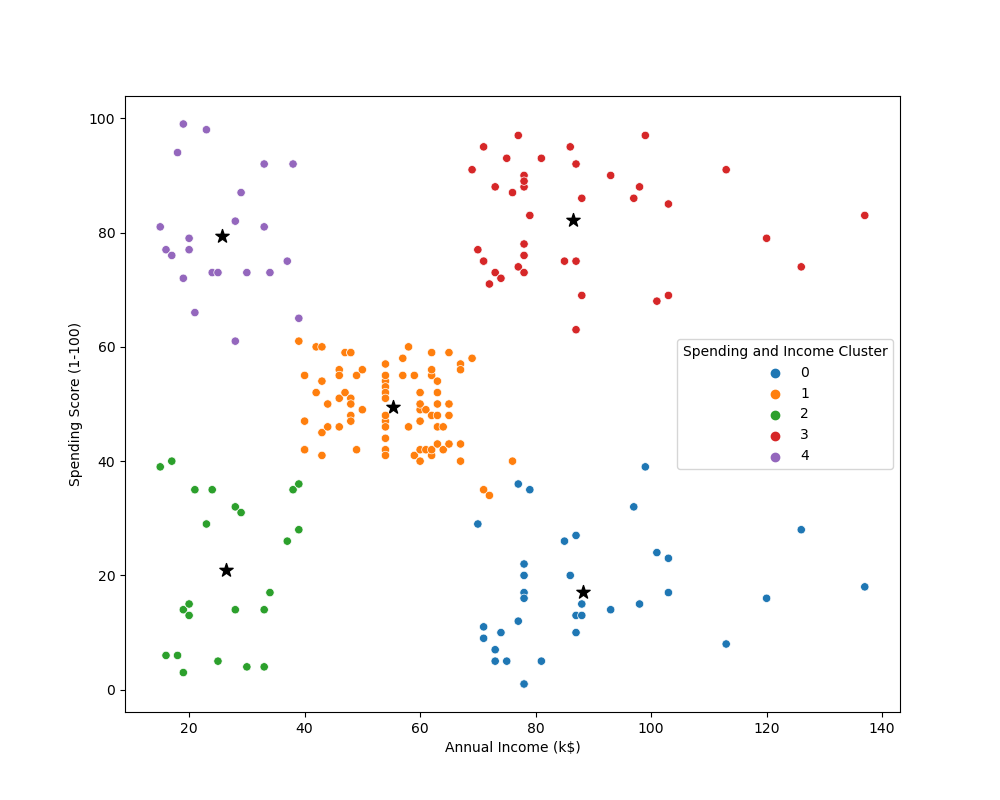

# Mall Customer Segmentation using K-Means Clustering

This project demonstrates customer segmentation using the **K-Means Clustering** algorithm on mall customer data. It aims to group customers based on their **Annual Income** and **Spending Score**, allowing businesses to identify distinct customer profiles and target them more effectively.

## 📁 Files in This Repository

- `Mall_Customers.csv`: Dataset containing customer demographic and behavioral data.
- `Clustering.csv`: Preprocessed or transformed clustering data (e.g., with labels or scaled features).
- `clustering.ipynb`: Jupyter notebook with data analysis, visualization, and K-Means clustering implementation.
- `clustering_bivariate.png`: Scatter plot showing clustered customer groups based on income and spending scores.

## 📊 Dataset Description

The dataset includes:

- `CustomerID`: Unique identifier for each customer
- `Gender`: Male/Female
- `Age`: Age of the customer
- `Annual Income (k$)`: Customer income in thousands of dollars
- `Spending Score (1-100)`: Score assigned by the mall based on customer behavior and spending nature

## 🚀 Project Workflow

1. **Data Preprocessing**:

   - Load and clean the dataset
   - Select relevant features: `Annual Income (k$)` and `Spending Score (1-100)`

2. **K-Means Clustering**:

   - Determine optimal number of clusters using the Elbow method
   - Train the K-Means model
   - Assign cluster labels to each customer

3. **Visualization**:
   - Plot clusters using a 2D scatter plot
   - Centroids are marked with black stars (★)



## 📌 Requirements

- Python 3.x
- Libraries:
  - `pandas`
  - `matplotlib`
  - `seaborn`
  - `scikit-learn`
  - `numpy`

Install dependencies using:

```bash
pip install pandas matplotlib seaborn scikit-learn numpy
```

## 💡 Use Cases

- Personalized marketing
- Customer behavior analysis
- Business strategy segmentation
- Loyalty program targeting

## 📜 License

This project is for educational purposes and provided under the MIT License.
